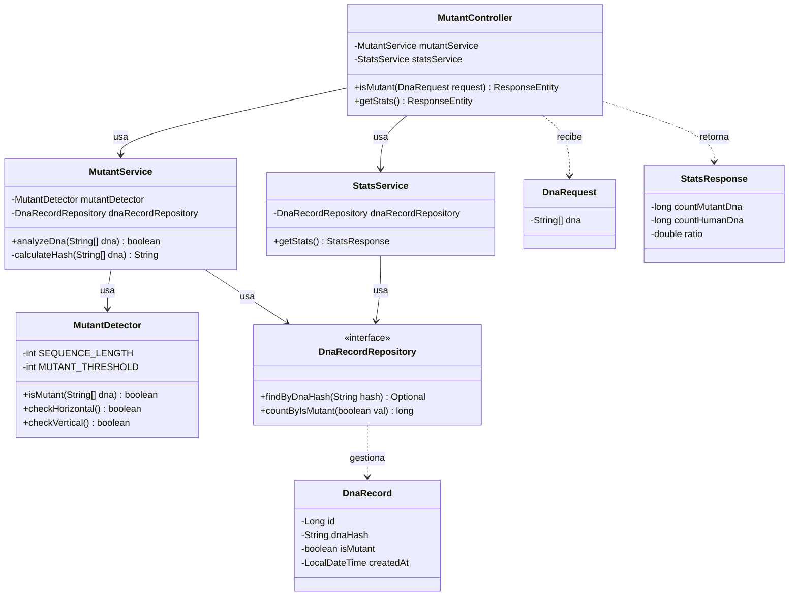

```mermaid
classDiagram
    %% Clases del Controlador
    class MutantController {
        -MutantService mutantService
        -StatsService statsService
        +isMutant(DnaRequest request) ResponseEntity
        +getStats() ResponseEntity
    }

    %% Clases del Servicio
    class MutantService {
        -MutantDetector mutantDetector
        -DnaRecordRepository dnaRecordRepository
        +analyzeDna(String[] dna) boolean
        -calculateHash(String[] dna) String
    }

    class StatsService {
        -DnaRecordRepository dnaRecordRepository
        +getStats() StatsResponse
    }

    class MutantDetector {
        -int SEQUENCE_LENGTH
        -int MUTANT_THRESHOLD
        +isMutant(String[] dna) boolean
        +checkHorizontal() boolean
        +checkVertical() boolean
    }

    %% Interfaces y Entidades
    class DnaRecordRepository {
        <<interface>>
        +findByDnaHash(String hash) Optional
        +countByIsMutant(boolean val) long
    }

    class DnaRecord {
        -Long id
        -String dnaHash
        -boolean isMutant
        -LocalDateTime createdAt
    }

    %% DTOs
    class DnaRequest {
        -String[] dna
    }

    class StatsResponse {
        -long countMutantDna
        -long countHumanDna
        -double ratio
    }

    %% Relaciones
    MutantController --> MutantService : usa
    MutantController --> StatsService : usa
    MutantService --> MutantDetector : usa
    MutantService --> DnaRecordRepository : usa
    StatsService --> DnaRecordRepository : usa
    DnaRecordRepository ..> DnaRecord : gestiona
    MutantController ..> DnaRequest : recibe
    MutantController ..> StatsResponse : retorna
```